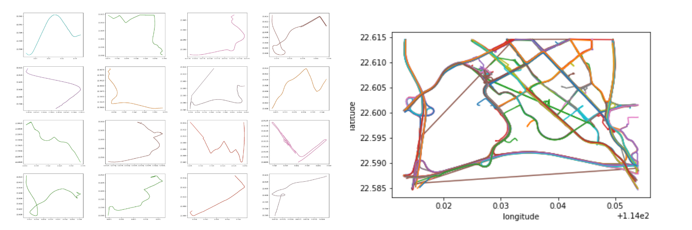

# Huaweicloud Competition -- Traffic Problem Report
|teamname: |nzhxjlzcu||
|--|--|--|
|人工智能学院|吕志存|181220038|
|人工智能学院|张含笑|181220067|

&emsp;&emsp;观察数据，得到每个文件中数据的基本内容：
- 201901_201903.csv / 201910_11.csv / 20191201_20191220.csv / toPredict_train_gps.csv: 网约车订单追踪数据，每一条记录是一个网约车订单，其中包含了订单编号id_order、用户编号id_user和数量不定的五元组gps_records ( 经度，纬度，速度，方向，时间戳 ) .
- train_TTI.csv: 记录了每个路口从2019/1/1 0:00 - 2019/12/21 23:50的交通信息，每十分钟一条记录，包括 ( 路段代号id_road，交通拥堵指数TTI，路过车辆平均速度speed，标准时间time)
- toPredict_train_TTI.csv: 记录了每个路口从2019/12/21 7:30 - 2020/1/1 20:50的交通信息，具体有记录的时间段为 ( 奇数时:30 - 偶数时:20 ) ，例如 ( 7:30 - 8:20, 9:30 - 10:20 ) ，每十分钟一条记录，包括 ( 路段代号id_road，交通拥堵指数TTI，路过车辆平均速度speed，标准时间time ) .
- toPredict_noLabel.csv: 是需要预测交通拥堵指数的样本. ( 样本号id_sample，路段代号id_road，标准时间time ) . 时间段一般为某小时中的前半小时或后半小时，与toPredict_train_TTI.csv中的时间段几乎没有重合.

&emsp;&emsp;我们需要先对 201901_201903.csv / 201910_11.csv / 20191201_20191220.csv 中的数据进行预处理，得到processed_train_data，对toPredict_train_gps.csv预处理得到processed_test_data. 利用processed_train_data和train_TTI.csv中的数据可以训练模型，由于需要用前1小时的数据对后10-30分钟进行预测，因此我们选择将所有数据按照时间窗口切分，分为训练集和验证集，并训练时间序列模型.再将processed_test_data作为输入可以得到最后的预测值. 

&emsp;&emsp;(photo/draw_road.py)我们选取了20191201_20191220.csv的少许样本，根据记录的经纬度将其行车路线可视化，256条记录可以基本描摹出深圳北站附近道路的样貌.

## 数据预处理
&emsp;&emsp;基本想法是遍历训练集，根据网约车gps的信息、运动方向和各路口的位置统计出各时间段经过各路口的车辆数，统计出各时间段经过各路口的车辆数. 由于训练集中已有路过车辆的平均速度，因此暂时不考虑统计网约车的速度情况，若有需要后期再进行调整. 网约车gps数据的清理在 /data_processing 中.

## 特征工程

## 建立模型

## 参数调优

## 源代码和项目结构

